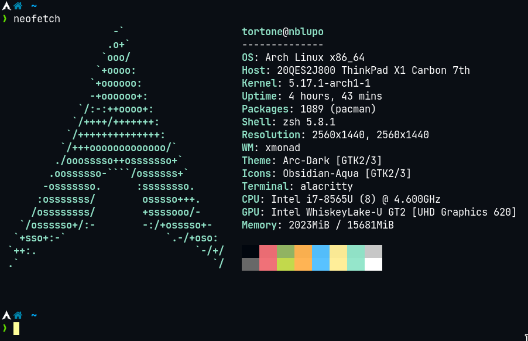

# dotfiles



### Linux distribution

Arch Linux (April 2022)

### Window manager components

- window manager: **xmonad**
- status bar: **xmobar**
- notification daemon: **dunst**		
- systray application: **trayer**
- wallpaper manager: **feh**
- screensaver: **slock** / **xautolock**
- display manager: **autorandr**
- multimedia framework: **pipewire** / **wireplumber**
- network: **nm-applet**
- bluetooth: **blueman-applet**
- keyring daemon: **gnome-keyring-daemon**
- keybind utility: **xbindkeys**
- clipboard manager: **greenclip** / **autocutsel**

### Applications

- Shell: **zsh**
   - plugins: oh-my-zsh, fzf, spaceship
- Editor: **vim**
   - theme: ayu-vim (patched)
- Terminal: **alacritty**
- MIME manager: **mimeo**
- Calculator: **mate-calculator**
- Web browser: **qutebrowser**
- Address book: **abook** 
- Mail reader: **neomutt** / **isync** / **notmuch**
- File browsing: **vifm** / **pcmanfm**
- Image viewer: **sxiv** / **viewnior**
- Video player: **vlc** / **mpv**
- Screencast: **ffmpeg** / **slop** / **screenkey**
- Audio mixer: **pulsemixer** / **pavucontrol**
- Launcher: **dmenu** / **rofi**
- Screenshot: **maim**
- Calendar: **gsimplecal**
- CPU frequency manager: **cpupower-gui**
- Keyboard layout: **setxkbmap**
- Audio CLI: **ponymix**
- Touchpad config: **xinput**
- Display manager: **xrandr** / **autorandr** / **arandr**
- Brightness control: **brightnessctl**
- Dotfiles manager: **stow**

### LightDM login manager

- config file: ```/etc/lightdm/lightdm-gtk-greeter.conf```	
- config utility: ```lightdm-gtk-greeter-settings```
	
### GTK configuration

- config utility: ```lxappearence```
- theme: ```Arc-Dark``` 
- icon theme: ```Obsidian```

### MIME configuration

- system wide desktop files: ```/usr/share/applications```
- user desktop files: ```.local/share/applications```
- override system default application: ```~/.config/mimeapps.list```
- open file with current default application: ```mimeo test.mp3```
- update desktop database: ```sudo update-desktop-database``` (produce mimeinfo.cache)
- list desktop files: ```mimeo --app2desk``` 
- list application / MIME-type association: ```mimeo --app2mime```
- get MIME-type from file: ```mimeo -m file.pdf``` 
- set preferred application from desktop file MIME-types: ```mimeo --prefer vlc.desktop```

### Fonts configuration

- terminal font:
    - ```JetBrains Mono NL Regular Nerd Font Complete.ttf```
- refresh fonts cache: ```fc-cache -fv```
- list fonts: ```fc-list```
	
### Keys binding configuration
	
- capture keys: ```xbindkeys -k```
	
### Keys combo

- set mobile mode (LCD display): ```CTRL+ALT+1```
- set docked mode (HDMI display): ```CTRL+ALT+2```
- display dmenu: ```ALT+P```
- display dmenu hub: ```ALT+O```
- display launcher: ```ALT+SHIFT+L```
- display rofi custom menu: ```ALT+SHIFT+P```
- display rofi drun: ```ALT+SHIFT+A```

